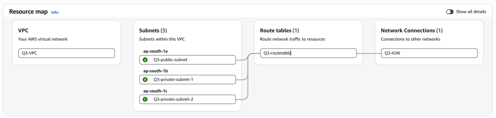
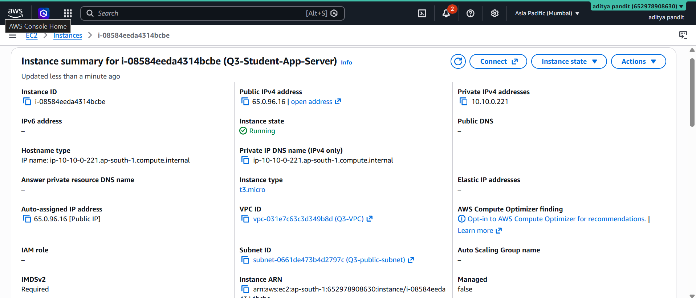
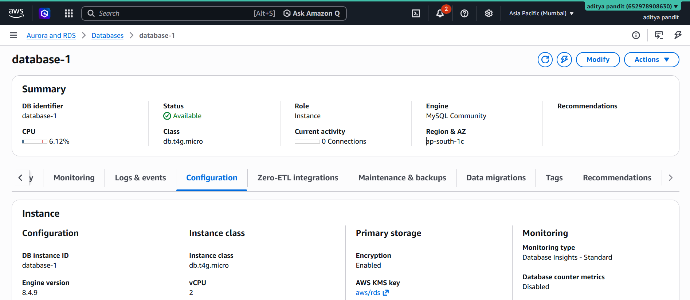
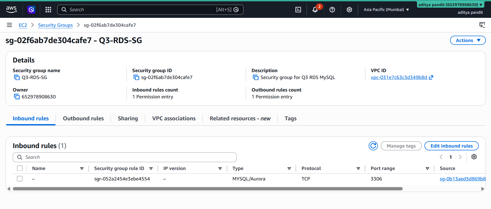
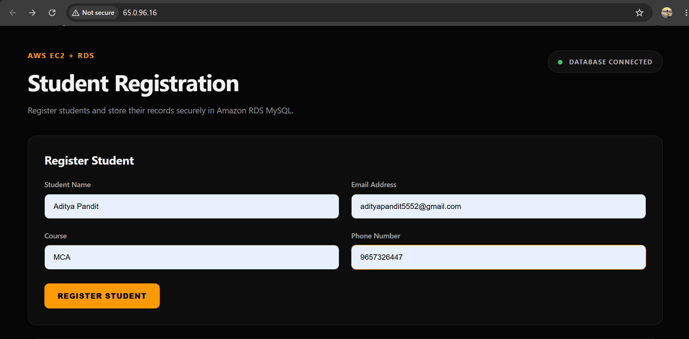
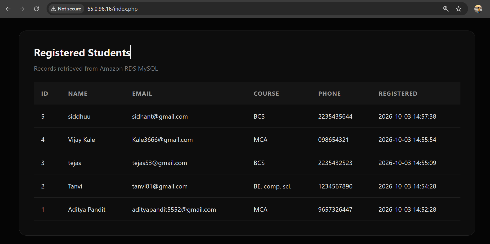
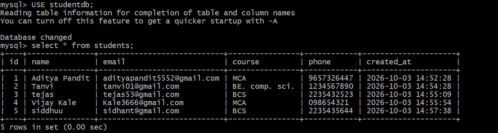

# AWS Q3 – EC2 + RDS Student Registration Application

## Project Overview

This project demonstrates the deployment of a student registration web application using **Amazon EC2 and Amazon RDS for MySQL**.

The application runs on an Ubuntu EC2 instance using Nginx and PHP. Student information submitted through the web application is stored in an Amazon RDS MySQL database.

The EC2 web server is placed in a public subnet, while the RDS database is deployed in private subnets. Database access is restricted through Security Groups.

## AWS Services Used

- Amazon VPC
- Amazon EC2
- Amazon RDS
- Internet Gateway
- Subnets
- Route Tables
- Security Groups

## Technologies Used

- PHP
- MySQL
- Nginx
- HTML5
- CSS3
- Ubuntu Linux

## Architecture

```text
                         INTERNET
                            |
                            v
                    Internet Gateway
                            |
                            v
                  Q3-Student-App-VPC
                     10.10.0.0/16
                            |
             +--------------+--------------+
             |                             |
             v                             v
       Public Subnet                 Private Subnets
       10.10.1.0/24                10.10.2.0/24
             |                     10.10.3.0/24
             |                             |
             v                             v
      Ubuntu EC2 Server               Amazon RDS
        Nginx + PHP                  MySQL Database
             |                             ^
             +---------- Port 3306 --------+
```

## Network Configuration

### VPC

```text
Name: Q3-Student-App-VPC
CIDR: 10.10.0.0/16
```

### Public Subnet

```text
Name: Q3-Public-Subnet
CIDR: 10.10.1.0/24
Availability Zone: ap-south-1a
```

The EC2 web server was deployed in this subnet.

### Private Subnets

```text
Q3-Private-Subnet-1
CIDR: 10.10.2.0/24
Availability Zone: ap-south-1a

Q3-Private-Subnet-2
CIDR: 10.10.3.0/24
Availability Zone: ap-south-1b
```

The private subnets were used by the Amazon RDS DB subnet group.

## Internet Gateway

```text
Name: Q3-Internet-Gateway
```

The Internet Gateway was attached to the VPC and used to provide internet connectivity to the public subnet.

## Route Table

```text
Name: Q3-Public-Route-Table
```

Route:

```text
Destination: 0.0.0.0/0
Target: Internet Gateway
```

The route table was associated with the public subnet.

The private database subnets were not configured with a direct route to the Internet Gateway.

## EC2 Configuration

```text
Name: Q3-Student-App-Server
Operating System: Ubuntu 24.04 LTS
Web Server: Nginx
Application: PHP
Subnet: Q3-Public-Subnet
```

The EC2 instance was assigned a public IPv4 address for web access.

## EC2 Security Group

```text
Name: Q3-EC2-SG
```

Inbound rules:

| Protocol | Port | Source |
|---|---:|---|
| SSH | 22 | My IP |
| HTTP | 80 | 0.0.0.0/0 |

The EC2 Security Group allows web access while restricting SSH access to the administrator's IP address.

## RDS Configuration

The database was created using Amazon RDS for MySQL.

```text
Engine: MySQL
Database Name: studentdb
Port: 3306
Public Access: No
```

The RDS instance was deployed using a DB subnet group containing the two private subnets.

## RDS Security Group

```text
Name: Q3-RDS-SG
```

MySQL port `3306` was configured to allow access from the EC2 Security Group.

```text
Q3-EC2-SG
     |
     | TCP 3306
     v
Q3-RDS-SG
     |
     v
Amazon RDS MySQL
```

This restricts database connectivity to the application server instead of allowing unrestricted internet access.

## Software Installation

The required packages were installed on the EC2 server:

```bash
sudo apt update
sudo apt upgrade -y
sudo apt install nginx php-fpm php-mysql mysql-client -y
```

Nginx was enabled and started:

```bash
sudo systemctl enable nginx
sudo systemctl start nginx
sudo systemctl status nginx
```

PHP-FPM was configured with Nginx to process PHP application files.

## Database Structure

Database:

```text
studentdb
```

Table:

```text
students
```

Table structure:

| Column | Type |
|---|---|
| id | INT |
| name | VARCHAR(100) |
| email | VARCHAR(100) |
| course | VARCHAR(100) |
| phone | VARCHAR(20) |
| created_at | TIMESTAMP |

The `id` column is the primary key and is automatically incremented.

## Application Features

The student registration application provides:

- Student registration form
- Student name field
- Email field
- Course field
- Phone number field
- Registration success/error message
- Registered student records table
- Retrieval of records from Amazon RDS

## Database Connectivity

The PHP application connects to the Amazon RDS MySQL database using the RDS endpoint and MySQL port `3306`.

The connection flow is:

```text
Browser
   |
   v
EC2 Web Server
Nginx + PHP
   |
   | MySQL / TCP 3306
   v
Amazon RDS MySQL
```

The EC2-to-RDS database connection was tested successfully.

## Application Testing

The application was tested by submitting student information through the registration form.

A successful registration displayed:

```text
✓ Student registered successfully.
```

The inserted student record was then displayed in the registered students table, confirming successful insertion and retrieval from Amazon RDS.

## Testing and Verification

The following tests were performed:

- Verified VPC configuration.
- Verified public subnet configuration.
- Verified private subnet configuration.
- Verified Internet Gateway attachment.
- Verified route table configuration.
- Verified EC2 deployment.
- Verified RDS deployment.
- Verified RDS public access was disabled.
- Verified EC2 Security Group.
- Verified RDS Security Group.
- Tested MySQL connectivity from EC2.
- Created the `students` table.
- Submitted student information through the web application.
- Verified successful insertion.
- Verified student records were retrieved from RDS.

## Result

The student registration application was successfully deployed on Amazon EC2 and connected to an Amazon RDS MySQL database.

Student records can be submitted through the web application, stored in Amazon RDS, and retrieved successfully.

## Screenshots

### 1. VPC Configuration



### 2. EC2 Instance



### 3. RDS Database



### 4. Security Groups



### 5. Working Registration Application



### 6. Successful Student Registration



### 7. Retrieved Student Record



## Project Structure

```text
AWS-Q3-EC2-RDS-Student-Registration/
│
├── README.md
├── index.php
├── style.css
├── db.php
└── screenshots/
```

## Security Considerations

- The EC2 web server is deployed in a public subnet because it must be accessible from the internet.
- SSH access is restricted to the administrator's IP address.
- The RDS database is configured with public access disabled.
- MySQL port 3306 is accessible only from the EC2 Security Group.
- Database credentials should never be exposed in a public GitHub repository.

> Before uploading this project to GitHub, make sure the actual RDS password is not present in `db.php`. Use a placeholder or keep the credential file out of the public repository.

## Conclusion

This project demonstrates a basic AWS two-tier application architecture using Amazon EC2 for the web/application layer and Amazon RDS MySQL for the database layer.

The project successfully demonstrates AWS networking, EC2 web server deployment, PHP application deployment, secure EC2-to-RDS connectivity, database operations, and end-to-end application testing.
